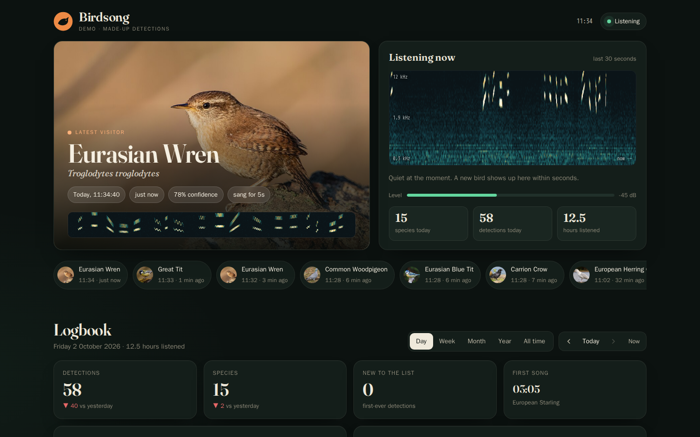
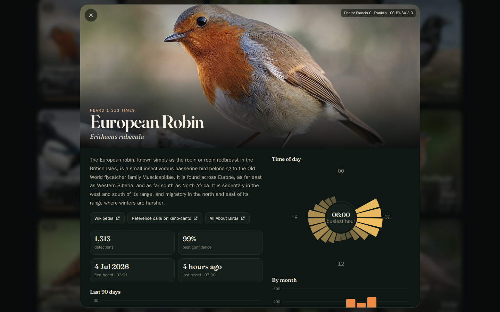
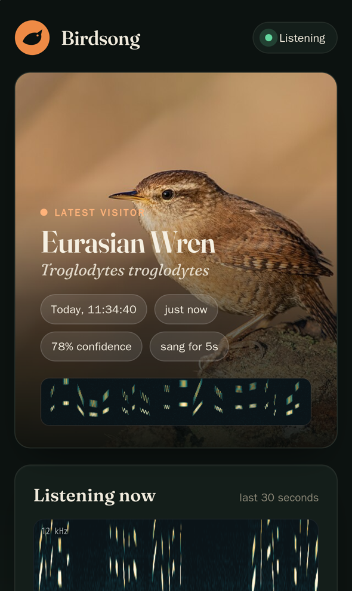

# Birdsong

**A 24/7 bird sound identifier with a live web page.** Plug a microphone into
your computer, point it at a window or the garden, and Birdsong listens around
the clock. It identifies birds with [BirdNET](https://birdnet.cornell.edu/)
(Cornell Lab of Ornithology) and shows them on a page you can open in any
browser: what's singing right now, today's visitors, and every day, week,
month and year since you started.

Runs on **Windows, Linux, macOS (Apple Silicon) and Raspberry Pi**. One file to
double-click; no Python install, no admin rights, no account, no cloud.



<p align="center">
  
  &nbsp;
  
</p>

## What you get

- **Live view.** The latest bird with a photo, a scrolling spectrogram of what
  the microphone hears right now, and "hearing now" as a bird sings.
- **Logbook.** Day, week, month, year and all-time views with previous/next
  navigation: detections per hour or day, a "who sang when" grid, comparisons
  with the previous period, and first song of the day.
- **Bird cards.** Photo cards for every species, sortable by most or fewest
  detections, name, most recently heard, first heard, confidence or rarity.
- **Every detection** with its time, confidence and spectrogram, plus a year
  calendar.
- **Local list.** Every species expected where you live, greyed out until
  heard, so it slowly fills in.
- **Each bird's page.** Photo (with credit), description, a link to Wikipedia,
  a time-of-day clock, the last 90 days and a monthly pattern.
- **Recordings for you only.** The admin can play, download, star (keep forever)
  or delete each clip. Visitors can't hear anything, because a microphone in a
  house picks up more than birds.
- **Looks after itself.** Clips are deleted after 30 days unless starred, total
  clip space is capped, and recording pauses if the disk gets low.
- **Light on resources.** It uses a few percent of one CPU core on a desktop PC and ~250 MB of RAM. A Raspberry Pi 4 or 5 copes fine.

## Quick start

### Easiest: download a release

Go to **[Releases](https://github.com/WyldVeil/birdsong/releases/latest)** and
download the zip for your computer. Each one contains everything: its own
Python, the libraries and the BirdNET model. There's nothing to install and
nothing more to download.

| Your computer | Zip | Then |
|---|---|---|
| Windows 10/11 (64-bit) | `birdsong-…-windows-x64.zip` | double-click **`run.bat`** |
| Linux PC (64-bit Intel/AMD) | `birdsong-…-linux-x64.zip` | `./run.sh` |
| Raspberry Pi 4/5 (64-bit OS), other ARM64 Linux | `birdsong-…-linux-arm64.zip` | `./run.sh` |
| Mac with Apple Silicon | `birdsong-…-macos-arm64.zip` | `./run.sh` in Terminal |

Unzip it somewhere permanent (e.g. `Documents\birdsong`) and run it. The
first start asks a few setup questions, then your browser opens at
**http://localhost:8080**.

*Windows: if SmartScreen warns about an unrecognised app, choose **More info →
Run anyway**. Mac: allow microphone access for Terminal when asked.*

### From source (git)

```sh
git clone https://github.com/WyldVeil/birdsong.git
cd birdsong
./run.sh          # Windows: run.bat
```

The first run downloads [uv](https://github.com/astral-sh/uv), which fetches
a private Python and the libraries into `.runtime/` (about 300 MB, once).
BirdNET is downloaded on first start.

### Just want to look first?

```
run.bat demo        (Windows)
./run.sh demo       (Linux/macOS)
```

This fills the page with a few months of made-up detections. No microphone is
needed. The admin login is `admin` / `demo`.

## Setup questions

| Question | Why |
|---|---|
| **Where is the microphone?** Type a town, postcode, or `lat, lon`. | BirdNET uses it to know which birds live near you, which cuts out most false identifications. It's rounded to ~1 km, stored only on your computer, and never shown on the page. |
| **Which microphone?** | Lists your inputs and records 4 seconds to check the level: not silent, not clipping. |
| **Admin password** | Lets you play, keep and delete recordings, and review rare birds. Username is `admin`. |
| **Who can open the page?** | **Just this computer** (localhost, the default), **devices on my home network** (phones and tablets on your Wi-Fi), or **the internet** through your own domain. You can also hide the page under a random secret path. |
| **Title / subtitle** | What the page calls itself. |

Change any of it later with `run.bat setup` / `./run.sh setup`.

## How identification works

Every 1.5 seconds the last 3 seconds of audio go through BirdNET. Species are
grouped using BirdNET's location model:

| Tier | Which species | Needs | Shown publicly |
|---|---|---|---|
| **Expected** | Occur near you in any week of the year, so out-of-season birds still count | 70% confidence | Yes |
| **Unusual** | Plausible within ~150 km | 85% | Yes, with an *Unusual* badge |
| **Rarity** | Anything else BirdNET knows (~6,000 species) | 95% **and** heard twice in a row | Only after you confirm it as admin |

A bird that keeps singing becomes **one** detection that grows, not dozens.
When it stops, the audio around it is saved as an MP3 clip with a
spectrogram. Non-bird sounds (dogs, engines, voices…) are never logged. If
speech is heard during a bird's clip, its spectrogram is hidden from visitors.

Identification is automatic and can be wrong. Admins can hide false positives
with one click.

## Using it

### Commands

Use `run.bat <command>` on Windows and `./run.sh <command>` elsewhere.

| Command | What it does |
|---|---|
| *(nothing)* | Listen and serve the page (runs setup the first time) |
| `setup` | Change location, microphone, password, access, title |
| `demo` | Preview with made-up data |
| `devices` | List microphones |
| `mic-test` | Record 5 seconds and report the level |
| `password` | Change the admin password |
| `analyse FILE…` | Identify birds in existing recordings (WAV, FLAC, OGG, MP3) and add them to the log |
| `autostart install` / `remove` / `status` | Start automatically (see below) |
| `selftest` | Run the tests and a real identification check |
| `--help` | Everything else |

Add `--port 9000` to `run` or `demo` to use a different port, and
`--no-browser` to not open a browser.

### Start automatically

```
run.bat autostart install        (Windows: starts hidden when you log in)
./run.sh autostart install       (Linux: systemd user service; macOS: LaunchAgent)
```

On **Linux**, to start at boot even when nobody logs in (a headless Pi or home
server), also run once:

```sh
loginctl enable-linger $USER
sudo usermod -aG audio $USER   # lets it open the mic without a desktop login; then reboot
```

On **macOS** you'll be asked to allow microphone access the first time.

### The microphone

- **Placement matters more than the microphone.** An open window or outdoors
  is far better than behind glass. Keep it away from fans, fridges and road
  noise if you can. A cheap USB mic works; a decent omnidirectional electret
  mic on a USB sound card works very well.
- **Level:** run `mic-test`. Aim for the room's background noise around
  −60 to −35 dBFS with no clipping. If it clips, turn the input volume down in
  your sound settings (Windows: *Settings → System → Sound → Input*; Linux: your
  desktop's sound settings or `pavucontrol`). The admin panel warns you if it
  clipped in the last hour.
- **Bats** aren't detected. They call in ultrasound, which needs a special
  microphone and a different model.

### Watching from your phone, or from anywhere

- **Same Wi-Fi:** in `setup` choose *Devices on my home network*. The page is
  then at `http://<your computer's IP>:8080` (setup shows the address). On
  Windows, allow Python through the firewall when asked.
- **From the internet with your own domain:** choose *The internet* in setup.
  Birdsong then listens on `127.0.0.1:8080` only, and you put a reverse proxy in
  front of it that provides HTTPS. With [Caddy](https://caddyserver.com/) that's
  one line in your `Caddyfile`:

  ```
  birds.example.com {
      reverse_proxy 127.0.0.1:8080
  }
  ```

  nginx:

  ```nginx
  location / {
      proxy_pass http://127.0.0.1:8080;
      proxy_set_header Host $host;
      proxy_set_header X-Forwarded-For $remote_addr;
      proxy_set_header X-Forwarded-Proto $scheme;
  }
  ```

  No domain or open ports? A free
  [Cloudflare Tunnel](https://developers.cloudflare.com/cloudflare-one/connections/connect-networks/)
  pointed at `http://localhost:8080` works too.
- **Secret path:** setup can put the page under something like
  `/k3j9x2q8mr/d8f2…/`. Anything else, including parts of that path, gets a
  plain "Not Found", so the page can't be found by guessing. The page also asks
  search engines not to index it.

## Settings

Settings live in `data/config.json`; setup writes the common ones. You can edit
the file by hand (stop Birdsong first):

| Setting | Default | Meaning |
|---|---|---|
| `min_conf` / `unusual_conf` / `vagrant_conf` | 0.70 / 0.85 / 0.95 | Confidence needed per tier |
| `sensitivity` | 1.0 | BirdNET sensitivity (higher means more detections and more mistakes) |
| `clip_days` | 30 | Delete unstarred clips after this many days |
| `max_clip_mb` | 4000 | Cap on total clip size (oldest unstarred go first) |
| `min_free_gb` | 5 | Stop saving clips below this much free disk |
| `spectro_days` | 365 | Keep spectrogram pictures this long |
| `host` / `port` / `base_path` | 127.0.0.1 / 8080 / `/` | Where the page is served |
| `behind_proxy` | false | Trust `X-Forwarded-*` headers from your reverse proxy |
| `audio_backend` / `device` | auto / default | Microphone (see `devices`) |
| `fetch_photos` | true | Download photos and descriptions from Wikipedia |
| `title` / `tagline` / `about` | | Text on the page |

## Privacy

- **Everything stays on your computer** in the `data/` folder: settings, the
  detections database, recordings, photos and the model.
- **Visitors can't hear recordings.** Only the admin can play them.
- **Your location** is used only to pick likely species, rounded to ~1 km, and
  never sent to the page.
- **The only connections Birdsong makes:**
  - GitHub, once, for the BirdNET model.
  - Wikipedia / Wikimedia Commons, for bird photos and descriptions.
  - OpenStreetMap Nominatim, only during setup and only if you type a place
    name rather than coordinates.
  - The launchers also download uv and Python from GitHub and PyPI on the first
    run.
- **Nothing about what you hear is sent anywhere.**

## Updating and uninstalling

- **Update:** download the new release zip, unzip it, and copy your old
  `data/` folder into it (or `git pull` for a git checkout). Your detections,
  recordings and settings carry over.
- **Uninstall:** `run.bat autostart remove` (if you installed it), then delete
  the folder. Nothing was installed anywhere else.

## Troubleshooting

| Problem | Fix |
|---|---|
| *"Microphone offline"* on the page | Run `devices` and `mic-test`; check the mic is plugged in and not muted; rerun `setup` to pick it again. Logs are in `data/birdsong.log`. |
| No birds after hours | Is the window shut? Try `mic-test` while you whistle or play a bird video near it. Lowering `min_conf` to 0.6 catches more birds, at the cost of more mistakes. |
| Too many wrong birds | Raise `min_conf`, hide them as admin, and check your location in `setup`. |
| Port 8080 already in use | `run.bat --port 9000`, or change it in `setup`. |
| Linux: no audio devices | Install PortAudio (`sudo apt install libportaudio2`) or PulseAudio/PipeWire tools (`pulseaudio-utils`). Headless: `alsa-utils` gives `arecord`. |
| Admin login doesn't stick behind an HTTPS proxy | Set `behind_proxy` to `true` (setup does this when you choose *The internet*). |
| Forgot the admin password | Run `password`. |
| Intel Mac | Not supported: Google's TFLite runtime has no Intel-Mac build. |

### Without the launcher

If you'd rather use your own Python (3.10–3.13):

```sh
python -m venv .venv
.venv/bin/pip install -r requirements.txt      # Windows: .venv\Scripts\pip ...
.venv/bin/python server.py
```

## Credits and licences

- **Birdsong code:** MIT licence (see [LICENSE](LICENSE)).
- **BirdNET** model by the K. Lisa Yang Center for Conservation Bioacoustics at
  the Cornell Lab of Ornithology and Chemnitz University of Technology,
  [CC BY-NC-SA 4.0](https://creativecommons.org/licenses/by-nc-sa/4.0/). It's
  downloaded on first run, not included here. The model licence is
  **non-commercial**, so don't use Birdsong commercially.
- **Bird photos and descriptions** come from Wikipedia and Wikimedia Commons
  under their own licences. Each photo's author and licence is shown on the
  bird's page.
- **[Fraunces](https://github.com/undercasetype/Fraunces)** typeface, SIL Open
  Font License (`birdsong/static/fonts/OFL.txt`).
- **[uv](https://github.com/astral-sh/uv)** (Astral) provides the private
  Python environment.

See [THIRD_PARTY_NOTICES.md](THIRD_PARTY_NOTICES.md) for details.
